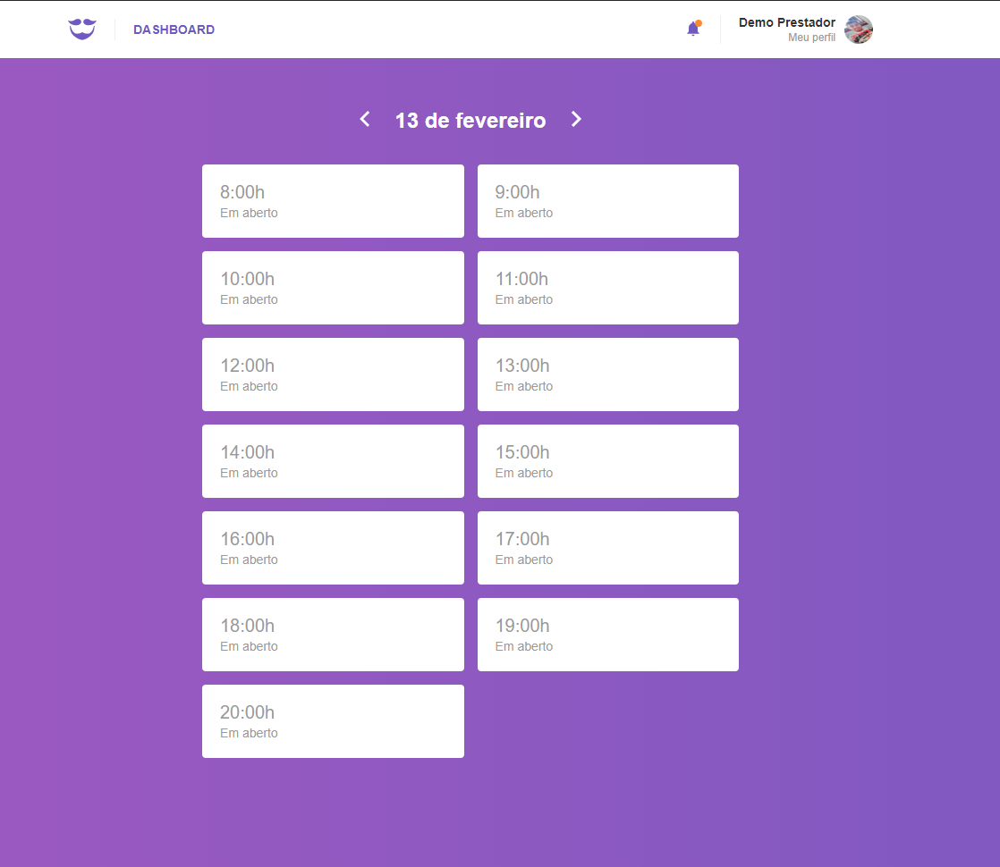

<h1 align="center">
    
</h1>

<h3 align="center">
  GoBarber Web - Aplicação desenvolvida durante o curso de React.
</h3>

<h3 align="center">
  #rocketseat, #react, #reduxSagas, #styledcomponents, #axios, #datefns, #history, #reactotron, #immer, #polished
</h3>

  <a href="#rocket-sobre-a-aplicação">Sobre a Aplicação</a>&nbsp;&nbsp;&nbsp;|&nbsp;&nbsp;&nbsp;
  <a href="#páginas-da-aplicação">Páginas da Aplicação</a>&nbsp;&nbsp;&nbsp;|&nbsp;&nbsp;&nbsp;

## :rocket: Sobre a Aplicação

A aplicação desenvolvida é o frontend do **GoBarber**, uma aplicação de agendamentos de serviços de beleza.

Abaixo segue todo o conteúdo que foi abordado no curso para o desenvolvimento da aplicação.

## GoBarber web
- Estrutura configurada
- Ajustes na API
- Configurando rotas
- Configurando Reactotron
- Rotas privadas
- Layouts por página
- Estilos globais
- Utilizando Root Import
- Estilização da autenticação
- Utilizando Unform
- Validações
- Configurando store
- Autenticação
- Armazenando perfil
- Persistindo autenticação
- Loading da autenticação
- Exibindo toasts
- Cadastro na aplicação
- Requisições autenticadas
- Configurando Header
- Estilizando notificações
- Notificações
- Página de perfil
- Atualizando perfil
- Foto de perfil
- Dados do Header
- Logout da aplicação
- Estilização do Dashboard
- Navegando entre dias
- Listando agendamentos

## Páginas da Aplicação

### Dashboard

### Notificações

### Perfil

